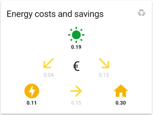

power-wheel-card
====

An intuitive way to represent the power and energy that your home is consuming or producing.
> This component is discussed [here](https://community.home-assistant.io/t/lovelace-power-wheel-card/82374) on the Home Assistant forum. There's also a [wiki](https://github.com/gurbyz/power-wheel-card/wiki/Troubleshooting-guide) on GitHub.

## Features
Features of the custom power-wheel-card:
* Displays the three values (solar, grid and home) in 'a wheel'.

* Has different views for showing power values, showing energy values and showing costs/savings: the *power view*, the *energy view* resp. the *money view*.
  The initial view can be set. Click the unit to switch between views.
* Has options for a different card title per view.
* Can auto-toggle between views.
  Click the recycle icon to turn on or off the auto-toggle.
  You can choose the initial state of the auto-toggle.
  You can choose a custom period (in seconds) between views.
* Calculates the current power that you nett consume from the grid: grid power.
  Input for the calculation is the power that you consume from the grid and the power that you produce to the grid.
* Calculates the current power that your home is consuming: home power.
  Input for the calculation is the power that your solar panels produce and the power consumed from and produced to the grid.
* Calculates the energy that you nett consumed from the grid: grid energy.
  Input for the calculation is the energy that you consumed from the grid and the energy that you produced to the grid.
* Calculates the energy that your home is consuming: home energy.
  Input for the calculation is the energy that your solar panels produced and the energy that you consumed from and produced to the grid.
* Calculates the costs/savings for all the energy values. Takes into account different rates for consuming and producing energy from and to the grid.
* Displays the transition between these power, energy and money values as arrows.
  E.g. if your solar power panels produce power, the arrow from solar to home turns active.
  And if your solar power panels produce enough power to deliver some back to the grid, the arrow from solar to grid turns active.
* Arrows can have values next to them. Zero values are suppressed. And values on the arrows are visible only when relevant. E.g. on a sunny day when part of your produced solar panel energy was returned to the grid and the other part was consumed by your home.
* Has support for setups that don't have separated grid sensors for consuming and producing.
  In these setups arrow values and arrow coloring are not available in *energy view* and *money view* due to lack of input details.
* Optionally uses icons of your own choice, which can be set by card parameters or taken from your `customize:` sensor settings.
* Optionally colors the consuming icons yellow and the producing icons green. You can choose your own colors for consuming and producing.
* Works for default theme and custom themes that use [standard CSS vars](https://github.com/home-assistant/home-assistant-polymer/blob/master/src/resources/ha-style.ts).
* Has support for [HACS](https://custom-components.github.io/hacs/) to check for a new release.

